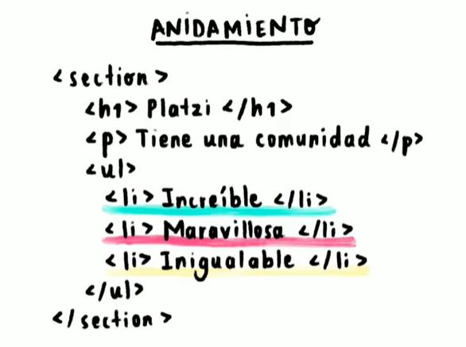
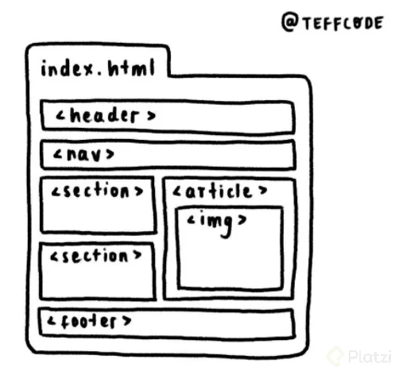
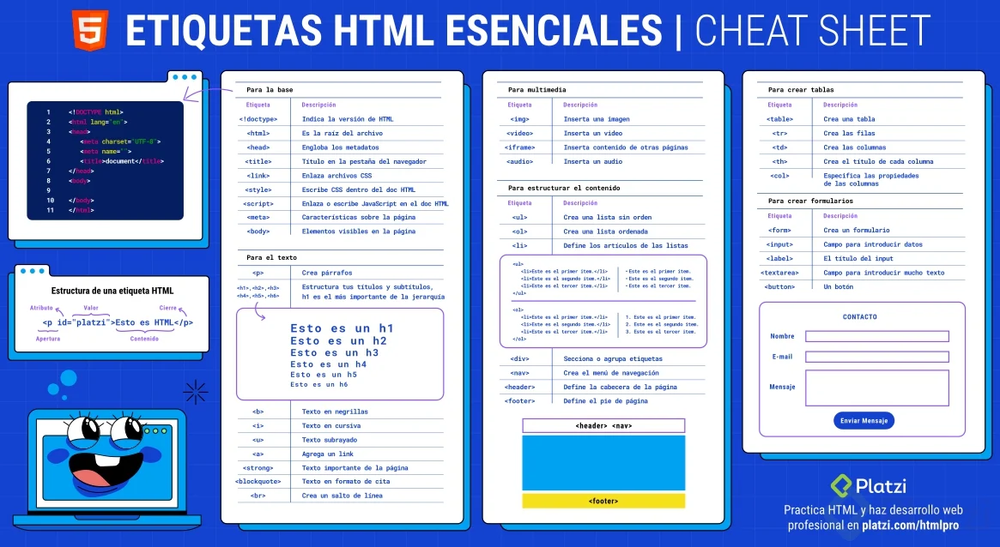
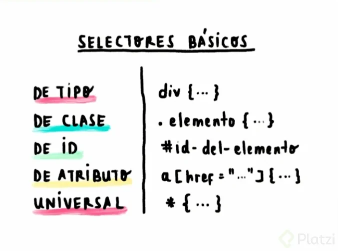
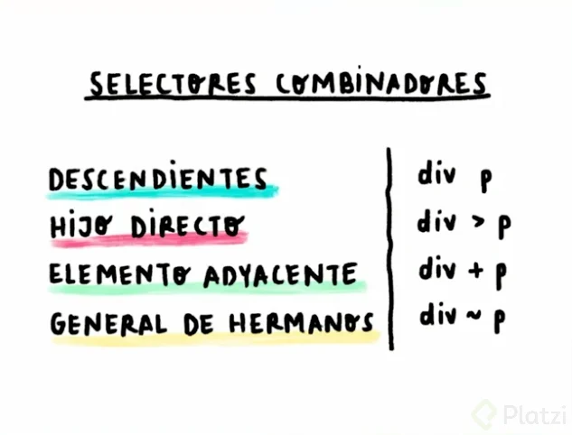
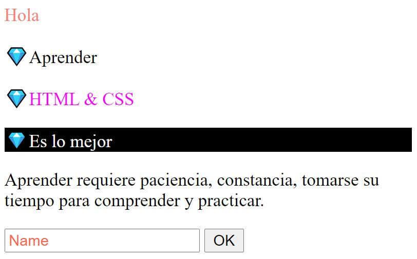
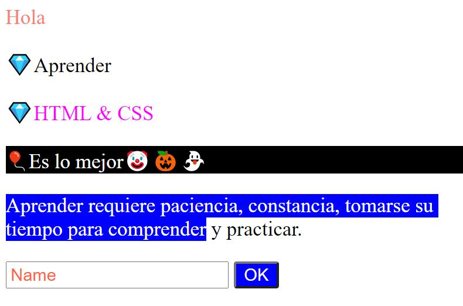
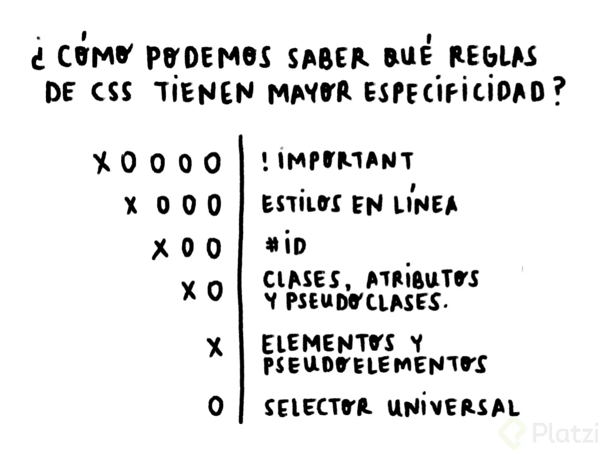
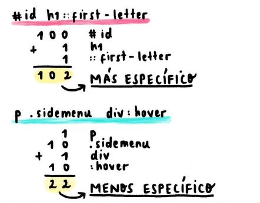

# CURSO DE FRONTEND DEVELOPER 2021
<!-- Comenzado el 23 de Octubre 2021 -->

HTML: HyperText Markup Language o Lenguaje de Marcado de Hipertexto.  
Sirve para crear la estructura de la página, permitiendo establecer donde se colocaran los textos, imágenes, botones, entre otras cosas.  

CCS:  Cascading Style Sheets u Hoja de estilos en cascada. Permite definir caracteristicas de estilo a los elementos que conforman la página dentro de la estructura definida.  

Ambos son complementos y trabajan juntos.  

## MOTORES DE RENDERIZADO

Enlace a Explicación de su funcionamiento [CSS Engine](https://hacks.mozilla.org/2017/08/inside-a-super-fast-css-engine-quantum-css-aka-stylo/)  

## ANATOMÍA DE UN ELEMENTO

La sintaxis de un **elemento** se conforma por dos etiquetas, una de apertura y otra de cierre identificada por el slash, dentro su contenido según el tipo de etiquetas.
~~~
<h1>Contenido</h1>
~~~

Los **atributos** son una caracteristica de cada etiqueta, se definen en la etiqueta de apertura y se define con el par atributo="valor".

~~~
<h1 class="title">...</h1>
~~~

El **anidamiento** es una estructura que permite crear etiquetas dentro de otras etiquetas. La etiqueta `<section></section>` crea esta estructura.

Hay etiquetas que no tienen apertura y cierre, se denominan **elementos vacíos**.

``

VSCode permite crear la estructura inicial tipeando `html:5` . 
~~~html
<!DOCTYPE html>
<html lang="en">
<head>
    <meta charset="UTF-8">
    <meta http-equiv="X-UA-Compatible" content="IE=edge">
    <meta name="viewport" content="width=device-width, initial-scale=1.0">
    <title>Document</title>
</head>
<body>
    <section>
        <h1>Título</h1>
        
Estoy practicando la estructura básica de html

        <ul>
            <li>Increíble</li>
            <li>Positivo</li>
        </ul>
    </section>
    
</body>
</html>
~~~

## HTML SEMÁNTICO  
Es el concepto que indica utilizar las etiquetas adecuadas, creadas con un significado y brindan de un sentido a los elementos al momento de diseñar la estructura de la página web, y no utilizar una etiqueta que sirve para mútiples propósitos como `
`.
Como buena práctica permite tener un código más claro y legíble al poder identificar los elementos que necesitamos, como ser un navegador dentro de la página.
Además permite al motor de búsqueda, por ejemplo Google, que identifique los elementos y contenido de nuestra página permitiendo así mejorar nuestro posicionamiento SEO dentro de la web. 
Es importante utilizar div solo para casos como mejorar estilos u ordenamiento y dentro de etiquetas contenedoras como ser header o footer, dado que google ignora las etiquetas div por no tener un significado específico o un sentido concreto de uso.

~~~html
Ejemplo de una estructura base de página web:
<body>
    <header>
        Hola
    </header>
    
    <nav>
        <ul>Item_1</ul>
        <ul>Item_2</ul>
    </nav>

    <footer></footer>
</body>
</html>
~~~

`<b>`: Pone tu texto en negritas (pero esta etiqueta NO tiene sentido semántico).  
`<strong>`: También pone tu texto en negrita, pero esta SÍ tiene sentido semántico (Google le da relevancia al texto que pongas ahí).  
`<i>`: Pone tu texto en cursivas (pero esta etiqueta NO tiene sentido semántico).  
`<em>`: También pone tu texto en cursivas, pero esta SÍ tiene sentido semántico (Google le da relevancia al texto que pongas ahí).  
` `: Hace un salto de línea, funciona como si diéramos un enter con el teclado.  

## ETIQUETAS ESENCIALES

Ejemplo de estructura base con etiquetas de imagen, enlace, elementos anidados, formulario, entre otros:
~~~html
<!DOCTYPE html>
<html lang="en">
<head>
    <meta charset="UTF-8">
    <meta http-equiv="X-UA-Compatible" content="IE=edge">
    <meta name="viewport" content="width=device-width, initial-scale=1.0">
    <title>Document</title>
</head>
<body>
    <nav>
        <ul>
            <li>About us</li>
            <li>Contact us</li>
        </ul>
    </nav>
    <section>
        

            
        

        

            <h1>Final Fantasy</h1>
            
Imagen descargada de Pexels.com

        

    </section>
    <form action="">
        <label for="comentario">Comentario</label>
        <input type="text" id="comentario">
    </form>
    <a href="https://www.pexels.com/es-es/buscar/final%20fantasy/">Go to see pexels.com</a>
</body>
</html>
~~~

## CSS
Estructura de un CSS:  
**Selector**: Indica y vincula un objeto html (por ej: etiqueta div) con un bloque de código CSS. Este contiene un conjunto de pares **Propiedad** - **Valor** que representan los atributos que se desean modificar.

Enlace a todos los colores disponibles de CSS [htmlcolorcodes.com/es/](https://htmlcolorcodes.com/es/).

Se definen los selectores de estilo dentro del head, dentro de una etiqueta ``

#### SELECTORES SIMPLES

1. **De tipo**: Estiliza Todas las etiquetas del mismo tipo, sirve para realizar ejemplos o cosas simples.

~~~html
   
</head>
<body>
    
 Hola...

</body>
~~~

2. **De Clase**: Se declara una clase a través del atributo class=".." posterior al nombre de la etiqueta, 

~~~html
   
</head>
<body>
    
Esta es la declaración de una clase

</body>
~~~

3. **De ID**: Similar a la clase, se declara con atributo id="..." posterior a la declaración de la etiqueta.

~~~html
<head>
    
</head>
<body>
    
1-2-3-4-5

</body>
~~~

4. **De Atributo**

~~~html
    
</head>
<body>
    <a href="https://platzi.com/home">Enlace a Platzi</a>
</body>
~~~

5. **Universal**: Se aplica a toda la hoja de estilos.

~~~html
   
~~~

Ejemplo:
~~~html
<head>
    <meta charset="UTF-8">
    <meta http-equiv="X-UA-Compatible" content="IE=edge">
    <meta name="viewport" content="width=device-width, initial-scale=1.0">
    <title>Document</title>
    
</head>
<body>
    
 Hola...

    
Esta es la declaración de una clase

    
1-2-3-4-5

    <a href="https://platzi.com/home">Enlace a Platzi</a>
</body>
</html>
~~~

#### SELECTORES COMBINADOS

1. **De hijos descendientes**: Para todos los "p" que esten dentro de "div".  

`div p{
    color: lime;
}`

2. **De hijo directo**: Se define como " div > p ". El estilo aplica a todas las etiquetas p que esten dentro de la etiqueta div. No aplica si se encuentra dentro de otra etiqueta que no sea la indicada.

~~~html

    
Aplica estilo

    <section>
        
No aplica estilo

    </section>

~~~

3. **Elementos adyacentes**: Para todas las etiquetas "section" que esten seguidas, ¡no aplica si solo esta dentro!, solo aquellos casos donde se encuentre acontinuación de una etiqueta "div". Si existiera una etiqueta como ser "p" y luego otra section, el estilo no se aplica.

~~~html

hijo directo

<section>Es lo mejor</section>
~~~

4. **General de hermanos**: Para todos los casos dentro de un mismo bloque de código donde exista una etiqueta div anterior a cualquier etiqueta section. No aplica en los donde la etiqueta section esta dentro de un div pero dentro del mismo bloque no le antecede ninguna de este tipo.

~~~html

hijo directo

<section>Es lo mejor</section>
~~~

### PSEUDO CLASES Y PSEUDO ELEMENTOS:

+ PseudoClases:  Funcionan como estados de los elementos y permite estilizar los elementos cuando sobre ellos ocurre una acción ejecutada por el usuario, como clikear un botón.
    + :active Para los casos donde se deja un botón activo.
    + :focus
    + :hover Al momento de pasar el cursor sobre un elemento.
    + :nth-child(n)

+ PseudoElementos: Permiten acceder a aquellos elementos html que no podemos acceder por las etiquetas convencionales. Como ser la primer letra de un texto, agregar algo al inicio o después de un texto, 
    + ::after
    + ::before
    + ::first-letter
    + ::placeholder

En VSCode " Control + . " Para acceder a los emojis.

~~~html
<!DOCTYPE html>
<html lang="en">
<head>
    <meta charset="UTF-8">
    <meta http-equiv="X-UA-Compatible" content="IE=edge">
    <meta name="viewport" content="width=device-width, initial-scale=1.0">
    <title>Document</title>
    
</head>

<body>
    <!--Defino el color inicial del elemento "saludo" y con la pseudo class hover el color al ser alcanzado por el cursor. -->
    
Hola

    

        
Aprender

        
HTML & CSS

        
Es lo mejor

    

    
Aprender requiere paciencia, constancia, tomarse su tiempo para comprender y practicar.

    <input type="text" placeholder="Name">

    <button>OK</button>

</body>
</html>
~~~

Con los efectos aplicados:

### CONCEPTO DE CASCADA Y ESPECIFICIDAD:

En CSS el orden en que las instruccionesde código son escritas SÍ importa.

Cascading Style Sheet (Hojas de estilo en cascada), se respeta un orden de prioridad en la declaración de los selectores, comenzando por el primer selector y sus  propiedades, luego por el selector que sigue en las líneas de código más abajo, y así sucesivamente.

Donde existen dos o más selectores que hacen referencia a un mismo elemento (como por ejemplo a una etiqueta p) y **ambos poseen el mismo nivel de  especificidad** (como determinar el color del texto) el conflicto se resuelve tomando y aplicando el último selector declarado, dado que este último reemplaza al primero.

~~~
En CSS:

En HTML:
<body>
    
Color

</body>
~~~

La Especificidad de los selectores: Es utilizado por los navegadores al entrar en conflicto con un elemento y no saber que selector aplicar, "Entre mayor especificidad, mayor va a ser la probabilidad de que sus declaraciones se usen sobre las demás".

Las declaraciones hechas en el selector más específico prevalecerá por sobre el resto.  

~~~
En CSS
#_id1{
    color: lime;}

.ejemplo{
    color: red;}

En HTML

        Este es un ejemplo declarando un elemento con un atributo id y de clase, en css se declararan dos selectores distintos que determinaran valores distintos para la misma propiedad.

~~~